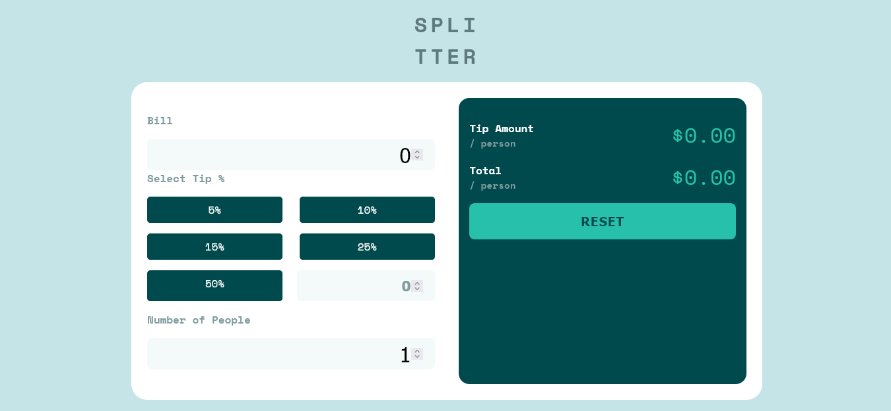
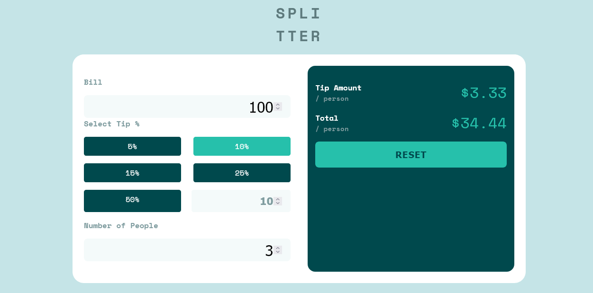
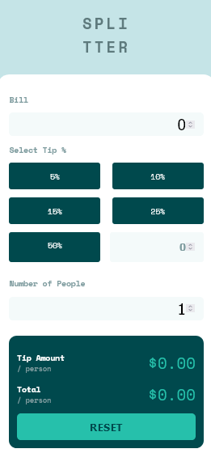
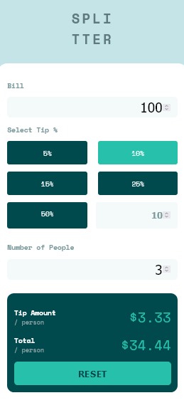

# Frontend Mentor - Todo app solution

This is a solution to the [Tip Calculator App on Frontend Mentor](https://www.frontendmentor.io/challenges/tip-calculator-app-ugJNGbJUX). Frontend Mentor challenges help you improve your coding skills by building realistic projects.

## Table of contents

- [Overview](#overview)
  - [The challenge](#the-challenge)
  - [Screenshot](#screenshot)
  - [Links](#links)
- [My process](#my-process)
  - [Built with](#built-with)
  - [What I learned](#what-i-learned)
  - [Continued development](#continued-development)
  - [Useful resources](#useful-resources)
- [Author](#author)
- [Acknowledgments](#acknowledgments)

## Overview

### The challenge

Users should be able to:

- View the optimal layout for the section depending on their device's screen size

### Screenshot

#### Desktop

#### Mobile

### Links

- Solution URL: [Github repo](https://github.com/edgarfb/tip-calculator-app)
- Live Site URL: [Tip Calculator App](https://edgarfb-tip-calculator-app.netlify.app/)

## My process

### Built with

- React
- Flexbox
- Mobile-first workflow

### What I learned

This is my first project with [React](https://reactjs.org/). I learned how to use components, how it is works, how it comunicated with other components, use it states, handling events, rendering lists, and much more.

### Continued development

I'm going dig deeper on React. Also I'm going read more about design pattern, data structure and algorithms to improve my code.

### Useful resources
- [React](https://reactjs.org/)
- [React-the-complete-guide](https://www.udemy.com/course/react-the-complete-guide-incl-redux/)

#### Teachers

- [Maximilian Schwarzmüller](https://twitter.com/maxedapps)
Professional Web Developer and Instructor

- Conquering responsive layout by [Kevin Powell](https://courses.kevinpowell.co/conquering-responsive-layouts) - 
This helped me for to achive a better layout. 

## Author

- Website - [Github](https://github.com/edgarfb)
- Frontend Mentor - [edgarfb](https://www.frontendmentor.io/profile/edgarfb)
- Twitter - [@edgarfb_ok](https://www.twitter.com/edgarfb_ok)

## Acknowledgments

I really enjoined and I learned a lot about layout whith the content of [Kevin Powell](https://www.kevinpowell.co/).\
You guys can enroll on [this course](https://courses.kevinpowell.co/conquering-responsive-layouts) totaly free.
